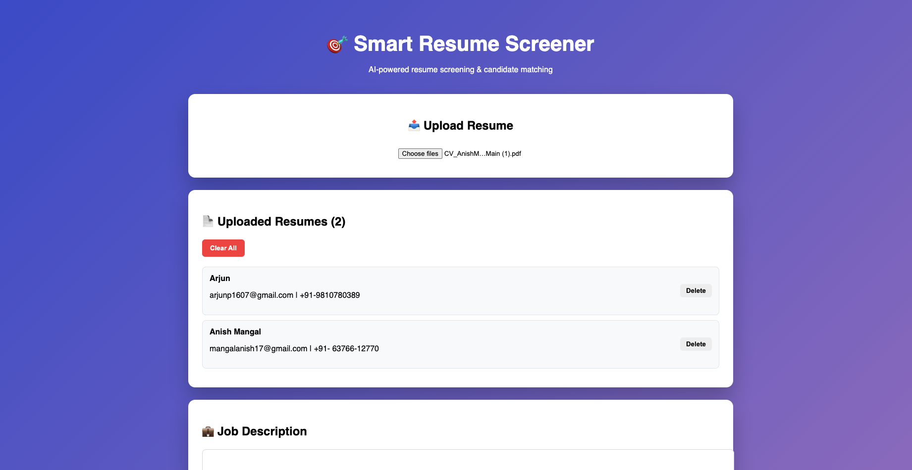
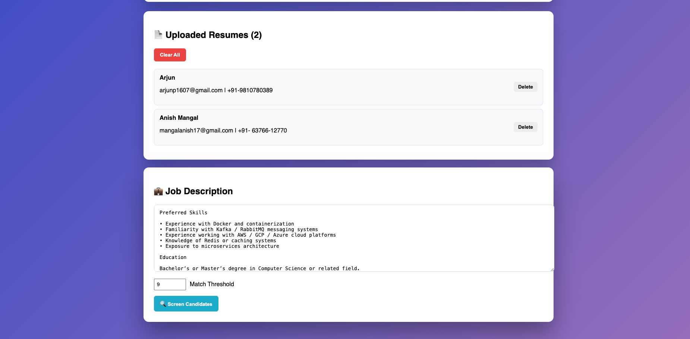
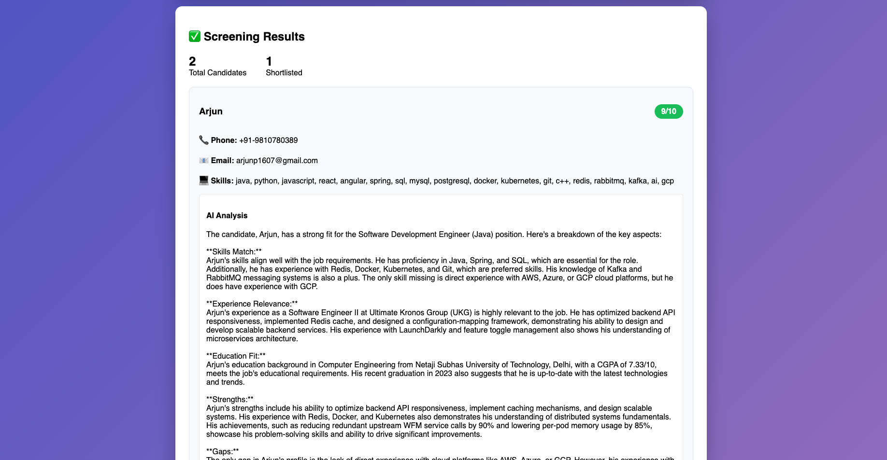

# Smart Resume Screener

An AI-powered resume screening platform that automatically evaluates candidate resumes against job descriptions using LLMs.  
The system extracts structured information from resumes, ranks candidates based on job requirements, and generates AI-powered explanations for recruiter decision-making.

---

## 🚀 Features

• Upload and parse PDF resumes automatically  
• Extract candidate details such as **skills, experience, education, email, and phone**  
• Match resumes against job descriptions using **LLM-based semantic analysis**  
• Generate **AI-powered candidate ranking and justification**  
• Screen **100+ resumes in seconds**  
• Modern **React-based recruiter dashboard**

---

## 🛠 Tech Stack

### Backend
- Java
- Spring Boot
- Spring Data JPA
- Apache PDFBox
- H2 Database

### Frontend
- React
- Vite
- Axios

### AI / LLM
- OpenAI-compatible API
- LLaMA-3.3-70B model

---

## 📊 Project Highlights

– Built an **AI-powered resume screening platform** using Spring Boot, React, and OpenAI-compatible API (LLaMA-3.3-70B), enabling semantic evaluation of candidate resumes against job descriptions.

– Implemented an **LLM-driven candidate ranking system** that analyzes skills, experience, and education against job requirements, reducing manual recruiter screening effort by **85–90%**.

– Developed a **resume parsing pipeline using Apache PDFBox and regex-based entity extraction** to convert unstructured PDF resumes into structured candidate profiles.

– Exposed **RESTful APIs** allowing recruiters to upload, manage, and evaluate **100+ resumes per job posting**.

---

## 📷 Application Screenshots

### Resume Upload Interface

### Uploaded Resumes Dashboard

### AI Candidate Screening Results

---

## ⚙️ System Architecture
React Frontend → Spring Boot REST APIs → Resume Parsing (PDFBox) → LLM Evaluation → Candidate Ranking

---

## 💡 Use Cases

• Automate recruiter resume screening  
• Quickly shortlist candidates based on job requirements  
• Reduce manual evaluation effort using AI  
• Provide explainable AI-based candidate recommendations

---

## 👨‍💻 Author

**Arjun**  
GitHub: https://github.com/arjun1607
